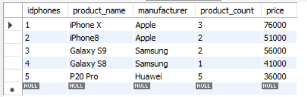

## 1. Создайте таблицу с мобильными телефонами, используя графический интерфейс. Заполните БД данными.

## 2. Выведите название, производителя и цену для товаров, количество которых превышает 2:

SELECT product_name, manufacturer, price

FROM phones

WHERE product_count > 2;

## 3. Выведите весь ассортимент товаров марки Samsung:

SELECT *

FROM phones

WHERE manufacturer = "Samsung";

## 4. Выведите информацию о телефонах, где суммарный чек больше 100000 и меньше 145000:

SELECT *

FROM phones

WHERE product_count * price BETWEEN 100000 AND 145000;

## 5. С помощью регулярных выражений найти:

## 5.1 Товары, в которых есть упоминания "iPhone":

SELECT *

FROM phones

WHERE product_name LIKE "%iPhone%";

## 5.2 Товары, в которых есть упоминание "Galaxy":

SELECT *

FROM phones

WHERE product_name LIKE "%Galaxy%";

## 5.3 Товары, в которых есть цифра:

SELECT *

FROM phones

WHERE product_name REGEXP '[0-9]';

## 5.4 Товары, в которых есть цифра "8":

SELECT *

FROM phones

WHERE product_name LIKE "%8%";